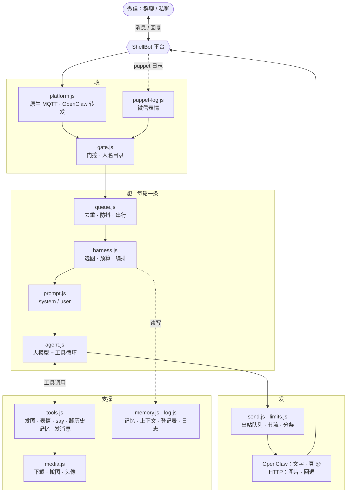

# shellbot-harness

让 ShellBot 平台上的微信机器人变成群里的一个「人」：一个常驻 Node 进程，npm 依赖只有 `mqtt`，平台接口直连。平台已有的能力（消息推送、历史记录、定时任务、屏蔽词、欢迎语）直接复用，不重造。

- **真 @**：文字走 OpenClaw，群里 @ 到人名字变蓝、有提醒。
- **多模型**：OpenAI 兼容接口（DeepSeek、各类中转、本地推理）与 Anthropic Messages API，fetch 直连无 SDK。
- **像真人**：@ / 引用 / 提名字 / 唤醒词触发，连发合并，分几条短消息发、边说边发图，记得上下文、会翻历史，可选插嘴，能斗图、看懂群友的微信表情、认识自己的头像；多个机器人在同一个群里会像群友一样互相接话。
- **稳与安全**：权限在 harness 不在模型，出站队列落盘续发、全局节流、静默时段，抗提示注入，会话隔离，私有内容不进 git。

文中「puppet」指平台上替机器人登录微信、真正收发消息的进程。

## 怎么工作



| 用途 | 通道 |
|---|---|
| **入站** | 原生 MQTT：`GET /api/v1/platformInfo` 拿 broker，订阅 `chat/<botId>/+`。平台每写一条历史就推一条，别人发的、没 @ 的都收得到。记录里没有「是否被 @」，由 `gate.js` 从文本判断。 |
| **入站 · 微信表情** | 平台不记录微信表情；harness 定时（`stickers.inboundPollSec`，默认 15 秒）拉一次 puppet 日志（`GET /aiapi/v1/bots/<id>/logs`）补上。 |
| **入站 · 补充**（可选） | OpenClaw 转发：带按 wxid 判定的「@ 了机器人」和图片的 OSS 地址，按消息 id 与原生记录对上，只用来补这两样。见「常见情况 → OpenClaw」。 |
| **出站 · 文字** | OpenClaw：带 `mentionIds` 发真 @，不经 HTTP 的文本过滤。 |
| **出站 · 图片 / 回退** | HTTP `POST /aiapi/v1/bots/<id>/messages/send`：图片 `type:10`；OpenClaw 没连上、或肯定没发出去时文字也走这里（@ 退化成文字）。 |
| **查询** | `/aiapi/v1`：机器人详情与状态、历史、群、联系人、puppet 日志、同步好友群表；上传走 `/api/v1/client/chat/upload`。 |

## 快速开始

前置：Node ≥ 22；ShellBot 平台账号和后台的「系统 token」；机器人已在平台登录，后台「聊天记录」没关（关了平台不写记录也不推送，启动日志会报 error）。

```bash
npm install
mkdir -p mybot.local/workspace && cp workspace/SOUL.md workspace/stickers.json mybot.local/workspace/   # 人格与图库模板
cp config.example.jsonc mybot.local/config.jsonc                    # 每个字段都带一行注释
# 编辑 mybot.local/config.jsonc，填好下表的必填字段（owner 先留占位，下一步拿到再填）
npm run probe -- --config mybot.local/config.jsonc --seconds 60     # 只听不发：这时私聊机器人一句，输出里括号内的 wxid 就是你，填进 owner
node src/index.js mybot.local/config.jsonc --hot                    # 启动；--hot = 改配置免重启、改代码自动重启
```

| 必填字段 | 怎么拿 |
|---|---|
| `host` | 平台地址 |
| `token` | 后台的系统 token（留空则读环境变量 `SHELLBOT_TOKEN`） |
| `bot.id` | 后台机器人列表里的数字 id |
| `owner` | 主人的 wxid，用 probe 拿（见上） |
| `workspace` | 这个机器人的工作目录，如 `mybot.local/workspace` |
| `agent.*` | 模型协议、地址、token、模型名 |
| `groups.allow` | `allowlist` 策略下要回的群，见「被拉进新群」 |

真实配置、人格、头像、记忆都放在 `<名字>.local/`（`*.local/` 已 gitignore），一个机器人一个目录。`workspace` 按仓库根目录解析；配置文件路径按启动时的当前目录解析。

## 部署

- **常驻**：`pm2 start src/index.js --name mybot --kill-timeout 25000 -- mybot.local/config.jsonc`。退出要先等没答完的轮、再清出站队列（见「关闭」），pm2 默认 1.6 秒就强杀，要放宽。
- **单实例**：一个机器人只能跑一个 harness，跑两个会重复回复、互踢连接。同一个 workspace 由其中的 `harness.lock`（内容是 pid）挡住第二个进程，锁里的进程已经不在就自动接管；同一个机器人配了两个 workspace 挡不住，只会看到连接互踢的告警。`network.mqttClientIdSuffix` 只用于排查时区分连接，正常留空。
- **多个机器人**：每个机器人一个 `<名字>.local/`，各起一个进程。同在一个群时它们把彼此当普通群友，会互相 @、接话、斗嘴；不想让某个机器人理另一个，就把对方的 wxid 放进它的 `blockedSenders`。
- **`--hot`**：改配置进程内热更、即时生效，写坏则整体保留旧配置。只有 `host`、`bot.id` 和 `network` 里定在连接上的字段（心跳、连接超时、重连退避、`mqttClientIdSuffix`）变了才重连；换 `workspace` 重建日志与记忆、出站队列跟着挪；`groups.allow` / `groups.policy` 变了重新预热成员表。改 `src/*.js` 自动重启 worker。worker 非正常退出按 5s、10s、20s …封顶 5 分钟无限重试，跑满 60 秒后退避清零；挂着等重试时改代码或配置立刻拉起。`SOUL.md`、`stickers.json`、记忆文件每轮实时读，不加 `--hot` 也免重启。

## 常见情况

- **发了没反应**：先看平台侧——puppet 没跑、等扫码、登录失效时消息根本进不了平台，harness 一条也收不到。启动时会查一次平台状态，不是 `running` 就记 error 并说明怎么办，之后每 `health.checkMinutes` 分钟复查、状态变化才记。平台侧正常再看日志（见下）：有没有 `inbound`、`verdict` / `reason` 是什么、模型答了什么、`sent` 的结果。
- **日志**：`<workspace>/logs/<日期>.jsonl`，文件名和 `ts` 都按 `timezone`。每轮一条证据链：`inbound`（`id`、`verdict` / `reason`；OpenClaw 补上 @ 的会再记一条带 `via: "openclaw"` 的）→ `tool` → `agent`（耗时、轮数、看了哪张图、上下文留了多少、token、结果）→ `outbound`（`mentions` 是真 @ 到的人）→ 每个出站任务一条 `sent`（`channel` 是 `openclaw` / `http`，`outcome` 是 `sent` / `uncertain` / `failed`）。`inbound` 之后的事件都带 `turn`（这一轮最后一条触发消息的 id），`grep <id>` 就能串起来。丢弃原因：`stale` / `quiet-hours` / `stale-outbox` / `repeat-of-say` / `shutdown`。
- **改了微信昵称**：@、引用、提到昵称都按昵称认，而平台记的是机器人登录那一刻的昵称，之后改名不更新。harness 能从机器人自己消息的回显里学到新名字，但 OpenClaw 发的文字没有回显，要等发一张图、HTTP 回退或在手机上手动发一条才学得到。想马上生效就在配置里填 `bot.name`（或在后台让机器人重新登录）。启动日志里「机器人「…」(id …)」那行就是当前认的名字。
- **OpenClaw**：后台给机器人开了「小龙虾 / OpenClaw」才能发真 @；没开时文字走 HTTP，@ 退化成纯文字，启动日志有 warn。想让 @ 判断不依赖昵称（机器人有群昵称、改了名都认），还要让平台把入站消息也转发过来：
  1. 机器人详情的「用户分组」页新建一个分组，「开启范围」选「部分群」、勾上要回的群（这个范围只要填「包含的群聊」；带「全部」的范围在网页上要求必填排除项）。OpenClaw 页的「开启分组」下拉是空的，就是还没建。想要「全部群和全部好友」又不排除任何人，可以用平台接口 `POST /aiapi/v1/bots/<id>/groups` 建（`scope: 1`，排除项给空数组）。
  2. 回 OpenClaw 页，「开启分组」选它，打开「转发所有消息」；想让表情包入库时稳定拿到可缩放地址，再开「转发所有媒体消息」。保存。

  「开启分组」没选时平台一条都不转发，两个转发开关开着也没用。harness 读到这些设置会自动订阅，没配就按昵称文本判断（启动日志会说缺哪一步）。后台中途改了设置，下次 `health.checkMinutes` 周期复查时重建连接（设成 0 就只在启动时读一次）。
- **被拉进新群**（`allowlist` 时）：把群 id（`@chatroom` 结尾）加进 `groups.allow`。群 id 可以让群里随便发一句，日志里该群的 `group-not-allowed` 入站记录就带；或私聊让机器人用 `platform` 的 `sync_contacts`，过半分钟再查 `rooms`。

## 配置

配置文件是 JSONC（允许注释和尾随逗号），`config.example.jsonc` 每个字段一行说明（由 `npm run config:example` 从 `src/config.js` 生成）。加载时校验必填、类型、枚举、数值范围（时长不能超过约 24 天，Node 定时器会溢出）、时区名（只认 `Asia/Shanghai` 这类 IANA 名）、正则（唤醒词不能匹配空文本），以及不认识的字段——多半是拼错或旧版字段，报错并提示迁移。`workspace` 必填，不能是仓库根目录或仓库里的 `workspace/` 模板目录。

旧版配置用 `npm run config:migrate <file>`：保留真实值、补默认值，挪了位置的字段（如 `mqtt.clientIdSuffix` → `network.mqttClientIdSuffix`）把值搬过去，不认识的字段丢掉并列出来，注释按当前说明重写；输出一律是 `<名>.jsonc`（原来是 `.json` 的，备份后删掉，启动命令记得改），旁边已有的 `.jsonc` 也先备份；备份名是 `.bak-<时间>`（`*.bak-*` 已 gitignore），校验不过就什么都不写。

字段按「接入 → 谁能叫它 → 怎么想 → 看什么 → 发什么 → 运维」排：

| 分组 | 管什么 |
|---|---|
| 顶层 | 接入：`host` · `token` · `bot.id` · `bot.name` · `owner`（只认 wxid）· `workspace` · `timezone` · `blockedSenders` |
| `dm` / `groups` | 谁能叫它：私聊策略 · 兜底话；群策略 · 白名单 · 唤醒词 · 提到昵称也触发 · 插嘴 `chime` · 回人补 @ `mentionBack` · 启动预热 `warmupHistory` |
| `agent` | 怎么想：协议 `openai` / `anthropic` · 地址 · token · 模型 · 输入 / 输出预算 · `effort` · `thinking` · 请求轮数 · 单次 / 一轮超时 · 重试 · 连发合并 · 工具结果上限 |
| `context` | 看什么：每轮看多少条 · 群成员名单多少人 · 跨会话发消息后附几条近况 |
| `images` / `stickers` | 图：看图 · 自动带图的窗口 · 下载限制 · 外站图先搬 `rehost` · 附头像的触发词；表情包尺寸、质量、图库上限、重发冷却、收群友微信表情的间隔 |
| `history` / `memory` | 翻历史默认 / 最多条数（最多 500）· 引用历史图片往前翻多少条；全局记忆与会话备忘的条数上限 · 单条字数 |
| `limits` | 发什么：发送间隔 · 排队超时 · 群里一轮几张图（明说要多发时放宽到几张）· 静默时段 · 分条 |
| `logs` / `health` / `network` | 运维：日志保留天数 · 平台侧复查间隔；发送 / 查询 / 拉配置超时 · 平台接口重试 · MQTT 心跳、连接超时、重连退避 · `mqttClientIdSuffix` |

只影响内部时序和安全上界的数（重试退避、跳转次数、单实例锁、去重窗口、各种截断长度）留在各模块顶部的具名常量里，不进配置。

环境变量：`SHELLBOT_TOKEN`（`token` 留空时读它）；`anthropic` 协议下 `agent.baseUrl` / `agent.token` 留空读 `ANTHROPIC_BASE_URL` / `ANTHROPIC_AUTH_TOKEN`（或 `ANTHROPIC_API_KEY`），地址也没有就用官方 `https://api.anthropic.com`。`TZ` 由 harness 按 `timezone` 设置。

## 怎么用

主人在微信里能说的（私聊机器人；群里也行，但权限收紧）：

| 你说 | 机器人做什么 |
|---|---|
| 发图或表情后「存成表情 点赞」「这几张分别存成 A、B、C」 | 入库，以后能按名字发；只发图不说「存」就当斗图接，不会存也不追问 |
| 「表情包有哪些」「删掉 xx」「把 xx 改叫 yy」「检查表情包」 | 列出 / 删 / 改名 / 探测链接是否失效 |
| 发图后「存成头像」 | 存成机器人自己的头像，问头像时照它描述 |
| 「记住：周五聚餐」 | 私聊里默认记进全局记忆、群里默认记进本群备忘；说「记到全局」「记到本群」可以指定 |
| 「给「xx群」发：…」「跟李四说一声…」 | 发到别的群 / 人，能真 @；私聊时回你目标会话的近况 |
| 「xx 群昨天聊了啥」「上周说的那个…」 | 翻平台历史，可按时间段；跨会话查只在私聊 |
| 「你在哪些群」「机器人状态」「同步一下群」 | 照清单答 / 查平台数据；群里只能查状态 |

群友：@机器人、引用它的消息、提到它的昵称、命中唤醒词都会触发一轮（不需要接的模型可以不回）；能让它看图、看表情、发头像、记一下本群的事。私聊按 `dm.policy`。

## 行为细节

### 触发

- 顺序：自己的消息 → 黑名单 → 会话准入 → 触发判定。没触发的群消息照样进该群上下文（最近 `context.size` 条）。
- 触发：引用机器人的消息；OpenClaw 转发说 @ 了它；或说话人自己写的部分（去掉开头的引用块）里有 `@昵称`、命中唤醒词、提到昵称（连着字母的、邮箱里的不算）。所以引用块里别人 @ 过它不算，先引用再在句首叫它也能唤醒。
- 机器人的群昵称：@ 和引用都认；「提到昵称」只认微信昵称（群昵称可能很短，中文又没有词边界）。群昵称只从 OpenClaw 标了「@ 了它」的消息里学（要配好入站转发，见「常见情况 → OpenClaw」）：引用块谁都能手打，不从那里学。
- 连发：同一会话同一人 `agent.debounceMs` 内的几条合并成一轮；不同会话并行、同一会话串行。
- 插嘴：群里没人叫也偶尔被唤起（冷却加概率控频、只对文字、静默时段不插），模型默认不接；开着 OpenClaw 文字转发时，先等 10 秒看是不是其实 @ 了它再插。插嘴那一轮哪怕由主人的话引起，也按非主人给工具。

### 回复

- 模型用单独一行 `---` 分条，像真人分几条发；超长的段自动再拆。一轮文字最多 `split.maxParts` 条（含 `say` 发的），`say` 把配额用完时最后的回复仍保底 1 条。`say` 说过的话最后原样再回一遍会被丢掉。
- 模型回 `NO_REPLY` 就不发；私聊里没答出来（拒答、轮数用尽、超时、出错）发 `dm.fallback`，这一轮已经用工具发过表情或 `say` 就不补；群里沉默。模型接口限流（429）按 `Retry-After` 或更长的退避重试，不隔半秒连撞。
- 发出去之前统一清洗（最后的回复、`say`、`send_message` 同一套）：漏进正文的思考标记去掉，夹在正文里的 `NO_REPLY` 去掉、正文照发；微信不渲染 Markdown，标题、粗体、代码围栏、公式定界符这些标记去掉、内容保留（单个 `*` `_`、列表不动）。

### @ 谁

- 群里被叫到的回复默认 @ 回触发者：模型没写就给第一条补上；最近 `quietWindowSec` 秒里说话的人少于 `minSpeakers`（就他一人在聊）时省掉；插嘴不补。
- 群聊每轮给模型一份 `<members>`：本群能 @ 到的人（在群里说过话的，最近说话的排前，最多 `context.rosterSize` 人），学到了群昵称的写成「微信昵称（群里叫 群昵称）」。只有真写出「@名字」才会 @ 到人；名单里的人一定 @ 得到，没说过话的人 @ 不到；@所有人做不了。
- 成员的群昵称从引用块（片段得是那人原话里的一段、至少 4 个字）和点选的 @ 里学，启动预热时也翻历史学；已有人用着的名字不学。
- 名字 → wxid：微信昵称、群昵称都能对上同一个人，不分大小写，名字里的空格漏写了也认。@ 出去显示群里大家看到的名字（有群昵称用群昵称，撞上别人的微信昵称就用微信昵称）。没对上的 @ 记 warn、按纯文字发（紧贴前一个字的「@不到」「@一下」是拿 @ 当动词，不算）；`send_message` 发到群时有没对上的 @ 直接退回让模型改。同一人连着 @ 几遍就 @ 几遍，隔着正文再提到只算一次。发出去时正文里不留「@已知名字」：开头 / 结尾成串的 @ 交给平台渲染成前缀，句中的只去掉 @ 号留名字。

### 图片、表情、头像

- **发图**：`send_image` 发任意公网直链。`images.rehost` 开着（且拿得到 apiSecret）时，外站图先上传到平台再发，在本轮自己的流程里做、不堵出站队列，搬不动按原地址发。平台域名、平台上传目录形态的地址、上传结果和从平台学到的 OSS 主机算已托管，不搬。群里一轮最多 `limits.groupImagesPerTurn` 张（图和表情合计）；叫它的人明说要多发（「都发出来」「全都秀一下」「挨个发」「发三张」），这一轮放宽到 `limits.groupImagesOnRequest` 张，插嘴不放宽。私聊不限。
- **群友的微信表情**：每 `stickers.inboundPollSec` 秒拉一次 puppet 日志（0 = 不收；上一次没拉完就跳过这一拍），新表情当普通入站消息进上下文，记录里显示「[表情：名字]」（表情商店的和部分自己加的带名字，收藏的图没有，显示「[表情]」），晚几秒到十几秒。刚发的表情和图片一样能给模型看。主人对它说「存成表情」时，先从微信 CDN 搬到平台托管再入库。puppet 日志只留最后 1000 行，拉取断了太久会漏；断过之后补上来的、超过 `limits.maxWaitMs` 的只进上下文、不触发回复。日志格式变了只会失去这一项。
- **表情包**：主人发图说「存成表情」入库，挂上压尺寸的参数（长边 `stickers.edge`），拿不到可缩放地址就存原图；一批里有一张存不了就整批不存。图库是 `stickers.json`，可手改。机器人发过的表情记进上下文，同一张群里冷却期内不重发；启动时和 `manage_stickers check` 探测链接是否失效。
- **头像**：放 `<workspace>/avatar.jpg`（png / gif / webp 也行），或主人发图说「存成头像」；都没有就用平台上的那张。有人问起头像时附给模型看，要发就 `send_avatar`。
- **识图**：引用了某人的图就找那人最近的图，没引用就取触发前 `images.window` 条内别人刚发的那张。harness 自己下载、转 base64 给模型，下载失败才给链接；模型只收 jpeg / png / gif / webp，其他格式不给看。
- **下载限制**：图片地址可能来自群成员，所以只拉公网地址，跳转每一跳都重新校验，平台域名豁免；大小先看 `content-length`、边读边卡 `images.maxBytes`；错误页不当图片。开着 fake-ip 代理（Clash 等）时所有域名都解析到 `198.18.0.0/15`，这一段放行，地址校验随之失效。

### 记忆与登记表

- 全局记忆 `MEMORY.md`（只有主人能写，所有会话可见）、会话备忘 `memory/<会话>.md`（成员可写、带署名），一条一行，超出条数归档到 `archive/`。
- `rooms.json` 收所有来过消息的群（方便按群名找 id）；`members.json` 按 wxid 存本群说过话的人（微信昵称和学到的群昵称）；`self.json` 记机器人自己在各群的群昵称；`contacts.json` 是私聊过的人。黑名单不进。
- 整文件写入都是原子写，写失败记 warn；读到坏 JSON 就改名成 `<原名>.corrupt-<时间>` 留底、记 warn，按空的继续。

### 连接、队列、关闭、预算

- 连接：broker 是百度 IoT 时，入站和 OpenClaw 都优先走 mqtts（1884）；连续 3 次连不上就试一次明文，明文也不通说明是网络问题、回到加密继续试。断线指数退避重连；连上不到 10 秒就被断开的不清零退避，连续 3 次会提示多半是同一 clientId 另有实例在跑。
- 限速：全局每 `minIntervalMs` 最多发一条，排队不丢；排队超过 `maxWaitMs` 才丢。静默时段只回直接触发（私聊、@、引用、唤醒词、提到昵称）。
- 出站队列同步落盘，崩溃后下次启动续发。文字优先 OpenClaw，肯定没发出去才回退 HTTP；结果未知（等确认时断线）不重发，宁可丢一条也不重复进群。往从没收到过消息的群发文字会提醒一次：机器人可能不在群里，而 OpenClaw 没有投递回执。
- 关闭：断入站 → 等没答完的轮（最多 15 秒，到点的记 `dropped: shutdown`）→ 清出站队列（最多 5 秒，剩下的留在盘上）→ 落盘 → 放锁。
- 一轮最多 `agent.turnTimeoutMs`（默认 5 分钟，不能小于单次请求超时 `agent.timeoutMs`）。输入超预算时按重要性截：先扣掉 system、工具定义和图，上下文必留被引用的原文、被 @ 的人最近一条、自己最近一条，其余按新到旧补齐；会话备忘最多占四分之一；单条触发消息最多 4000 字。

## 工具与权限

| 工具 | 谁能用 | 作用 |
|---|---|---|
| `send_image` / `send_sticker` / `send_avatar` | 所有触发者 | 发图、按名字发表情包、发自己的头像 |
| `say` | 所有触发者 | 先发一段话再继续 |
| `read_history` | 所有触发者 | 翻平台历史（可翻页、可按时间段），合并本地发送记录；**仅主人私聊**能查别的会话 |
| `remember` | 所有触发者 | 主人可写全局记忆；其他人只能写本会话备忘（带署名） |
| `save_sticker` / `manage_stickers` / `save_avatar` | 仅主人 | 表情包入库与管理、存头像；`save_sticker` 只在主人这轮说了「存 / 收藏」、`save_avatar` 只在提到「头像」时才给模型 |
| `send_message` | 仅主人 | 给别的群 / 人发文字，能真 @；私聊时附目标会话近况，群里不附、不提目标 |
| `platform` | 仅主人 | 查机器人状态、群、联系人、会话、定时任务，同步好友群表；群里只能查状态 |

安全设计：

- **权限在 harness**：主人只认 wxid；非主人拿到的工具里根本没有跨会话参数，运行时再锁一次。同一个工具一轮里报了同样的错，第二次起明确告诉模型别再重试。推送过来的记录不带来源校验，所以主人发的每条消息都要到平台历史里核对（id、时间、内容都对得上，且是实时推送的）才给主人权限；对不上的这一轮按非主人处理，记录里标「身份未核实」，存表情、存头像也不会取它。
- **数据与指令分离**：聊天记录、备忘、工具结果都框定成数据；伪造的框定标签转成全角失效；多行正文的续行缩进，伪造不出别人的发言行。从聊天里学来的名字要像个名字（2~16 字、不含括号顿号等），伪造不出名单项。规则由代码注入 system，改 `SOUL.md` 去不掉（`SOUL.md` 里的 HTML 注释不进 system）。
- **会话隔离**：上下文、备忘按会话分文件；群里不提别的群；只有全局记忆跨会话共享，且只有主人能写。

## 平台限制（实测）

**投递**

- HTTP 发送返回成功只表示受理，puppet 自己去拉图、发微信，失败不回报；不管发没发出去，历史里都记一条。机器人离线是 409。OpenClaw 发送也没有回执。
- puppet 拉外站图，海外或临时图床超时就静默丢图，所以要先搬到平台（`images.rehost`）。puppet 发送前会再做一次 URL 编码，harness 出站前统一解码。
- HTTP 发文字有过滤：含 `Error:`、`TypeError`、`AxiosError`、`FetchError`、`TimeoutError`、`OpenAI error` 或以 `ReferenceError:` / `Run failed:` 开头的整条不发；私聊删掉所有 `@所有人` 和 `all` 子串（call、really 都会被掏空）；群里以 `@所有人` / `@all` 开头会当成 @全体；字面的 `\n` 被换成换行。OpenClaw 没有这些处理；回退 HTTP 时 harness 在这些串里插零宽空格，显示不变、过滤失效。
- 真 @ 由平台渲染成消息开头的一串 `@A @B`，正文里再写 @ 会重复显示或被删掉。@全体（管理员专属）和引用回复都发不了。

**入站**

- 原生记录没有「是否被 @」，只能靠文本里的名字；也没有群昵称，只有微信昵称。学不到群昵称的人，用群昵称叫他就对不上；OpenClaw 转发能按 wxid 补上「@ 了机器人」。
- 引用消息只有「昵称：原文」文本，引用图片没有原图 id 或地址，只能按昵称找那人最近的图；引用块里的名字可能是群昵称。
- 图片只收 png / jpg / jpeg / gif，webp、bmp 等扩展名的文件平台不记录；视频号、位置、合并转发（个人微信协议下）、语音（没开平台的语音转文字时）都进不来；微信表情不进记录，由 harness 从 puppet 日志补。链接卡片显示「标题｜描述」，文件显示文件名。
- 机器人自己发的消息：HTTP 发的、手机上手动发的有回显，OpenClaw 发的没有；平台自带回复的回显，昵称带「(机器人)」后缀。

**数据**

- 没有群成员接口，成员表只能从消息里学。群 / 联系人列表是快照：同步只补新的，群改名、退群不会更新。
- 接口响应里的 id 类字段是编码过的字符串，harness 一律用配置里的数字 id。

## 目录与开发

```
src/index.js        入口：--hot 时进监督进程，否则直接跑 harness
src/supervisor.js   --hot 监督进程：改代码重启 worker，挂了退避重试
src/harness.js      编排：入站 → 门控 → 队列 → 选图 → 预算 → 模型 → 出站；单实例锁、热更新、退出收尾
src/config.js       默认值、逐字段说明、校验、JSONC 读写
src/api.js          平台接口客户端：鉴权、重试、信封解析
src/platform.js     平台适配：机器人信息与历史、原生 MQTT、OpenClaw 收发、HTTP 文本雷区、托管判定
src/puppet-log.js   从 puppet 日志解析微信表情、图片的可缩放地址
src/fetch-image.js  图片下载：公网校验、跳转、大小上限、类型识别；表情包链接探测
src/media.js        图片与头像：下载、搬到平台托管、头像
src/send.js         发送：出站队列落盘续发、OpenClaw / HTTP 通道选择与回退
src/limits.js       队列节奏、节流、静默时段、分条
src/queue.js        去重、防抖合并、每会话串行
src/gate.js         门控、人名目录（微信昵称 / 群昵称）、@名字 → wxid、补 @
src/prompt.js       提示词组装、输出清洗、token 估算、按重要性截断
src/agent.js        模型调用循环（openai / anthropic）
src/tools.js        模型可调用的工具
src/memory.js       人格、记忆、图库、头像、上下文、登记表、发送记录
src/log.js          控制台摘要 + 每日 JSONL
src/util.js         小工具
bin/probe.js        连通性探测
bin/config.js       生成示例配置 / 迁移旧配置
test/               单测（node --test），harness.test.js 注入假 IO 跑通整条流水线
workspace/          SOUL.md、stickers.json 模板
```

- **测试**：`npm test`，不联网、不碰平台。`runHarness({ deps })` 可以替换 `makeApi` / `makeAgent` / `makeLog` 和平台 IO 函数（`loadBot`、`fetchHistory`、`startMqtt`、`startOpenClawSender`、`fetchImageData`、`checkStickers`、`makeStickerFeed` 等，工具里用到的也经它传入）；返回的 `inbound(msg)` 注入入站消息、`pollStickers()` 立刻拉一次微信表情、`reload()` 触发热更新、`close()` 收尾不退进程。
- **什么进配置**：影响机器人行为与体验的参数进配置并给默认值；协议常量、内部时序、安全上界放在各模块顶部的具名常量里。
- **私有内容**：真实配置、人格、头像、记忆、日志都在 `<名字>.local/`；别把真实 wxid、群 id、密钥写进 `src/`、`test/` 或文档。

## License

[MIT](LICENSE)
